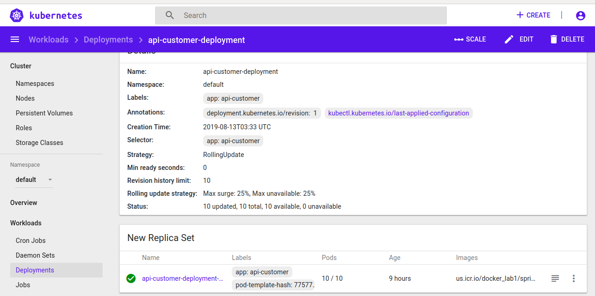
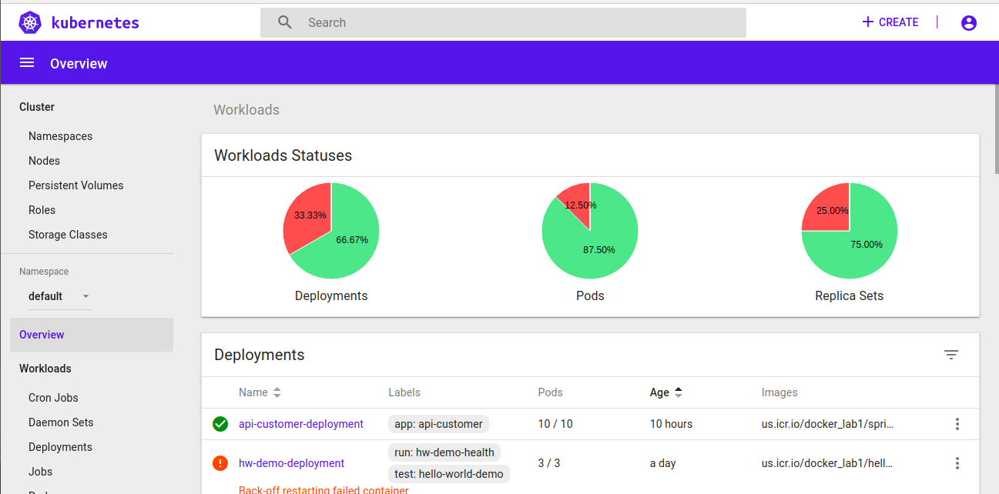

# Microservices with Spring Boot and IBM Cloud Kubernetes Service

Example of Microservices with Spring Boot and IBM Cloud Kubernetes Service.

## The twelve factors
To effectively design and build apps for the cloud, you should understand the twelve factors:

I. Codebase: One codebase tracked in revision control, many deployments

II. Dependencies: Explicitly declare and isolate dependencies

III. Config: Store configuration in the environment

IV. Backing services: Treat backing services as attached resources

V. Build, release, run: Strictly separate build and run stages

VI. Processes: Execute the app as one or more stateless processes

VII. Port binding: Export services via port binding

VIII. Concurrency: Scale out via the process model

IX. Disposability: Maximize robustness with fast startup and graceful shutdown

X. Dev/prod parity: Keep development, staging, and production as similar as possible

XI. Logs: Treat logs as event streams

XII. Admin processes: Run admin/management tasks as one-off processes

For more information please visit: https://www.12factor.net/

## IBM Cloud CLI command

Previously created imagem docker

1. $ ibmcloud login
2. $ ibmcloud plugin list
3. $ ibmcloud cr login
4. $ ibmcloud cr namespace-add docker_lab1
5. $ docker push us.icr.io/docker_lab1/springboot-microservice-cloud:1.0

### IBM Cloud - Registry

6. $ ibmcloud cs clusters

7. $ ibmcloud cs workers cluster-jm

8. $ ibmcloud cs cluster-config cluster-jm

9. $ kubectl apply

10. $ kubectl get pods

11. $ kubectl get all

### IBM Cloud - Kubernetes Dashborad

### IBM Cloud - Kubernetes Clusters

### Postman - Create Customer

### Postman - Get Customer 

