# Example Kubernetes - Springboot Microservices Cloud

IBM Cloud is used for this example

# IBM Cloud CLI command

Previously created imagem docker
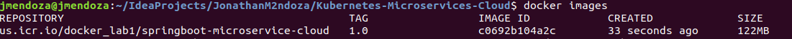

1. $ ibmcloud login
2. $ ibmcloud plugin list
3. $ ibmcloud cr login
4. $ ibmcloud cr namespace-add docker_lab1
5. $ docker push us.icr.io/docker_lab1/springboot-microservice-cloud:1.0

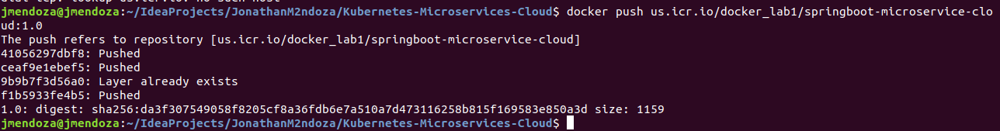

IBM Cloud - Registry

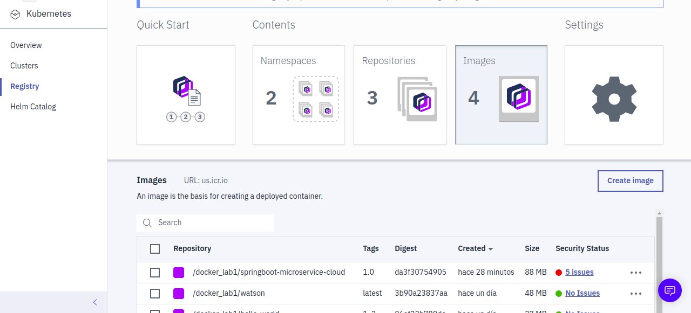

6. $ ibmcloud cs clusters

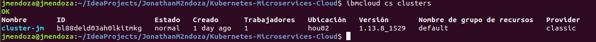

7. $ ibmcloud cs workers cluster-jm

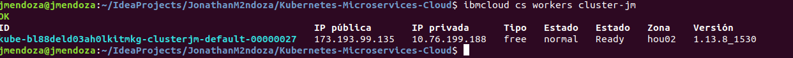

8. $ ibmcloud cs cluster-config cluster-jm

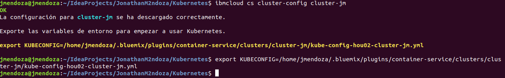

9. $ kubectl apply

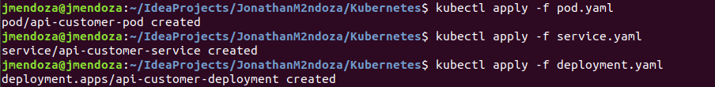

10. $ kubectl get pods

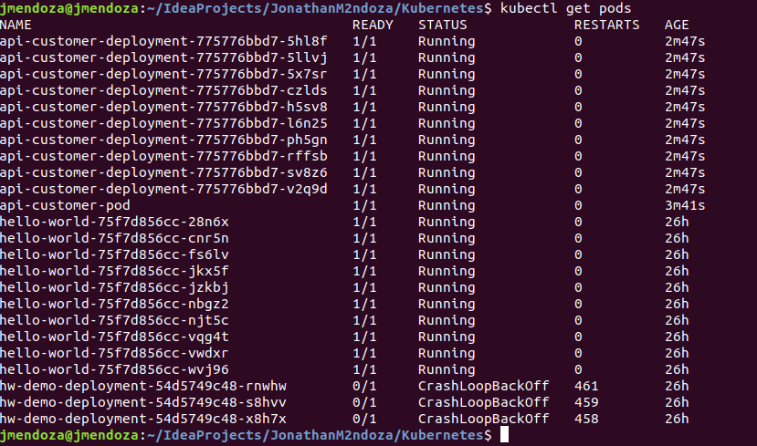

11. $ kubectl get all

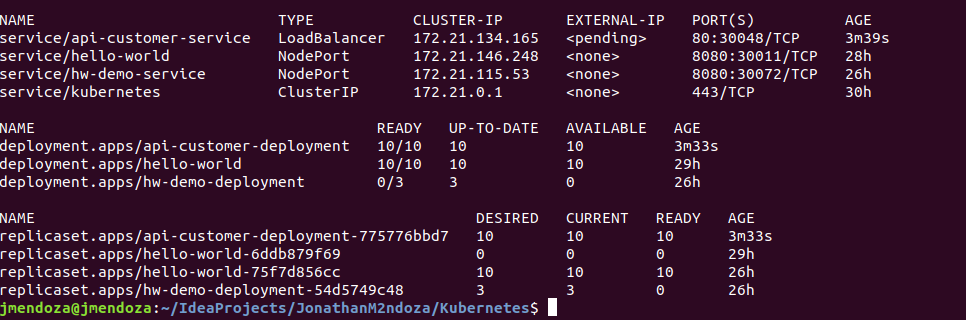

IBM Cloud - Kubernetes Dashborad

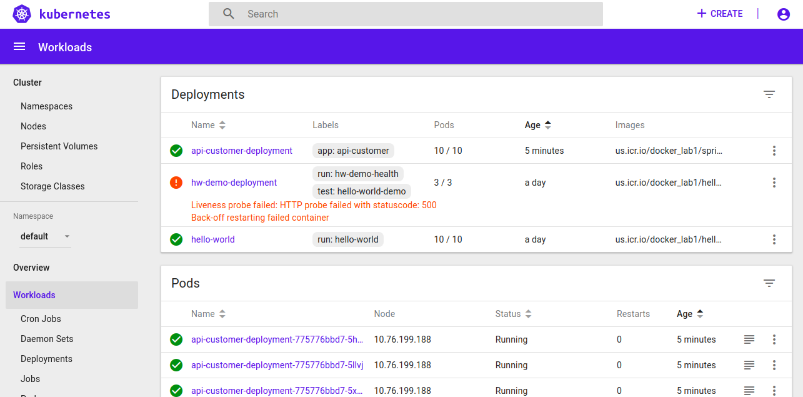

IBM Cloud - Kubernetes Clusters

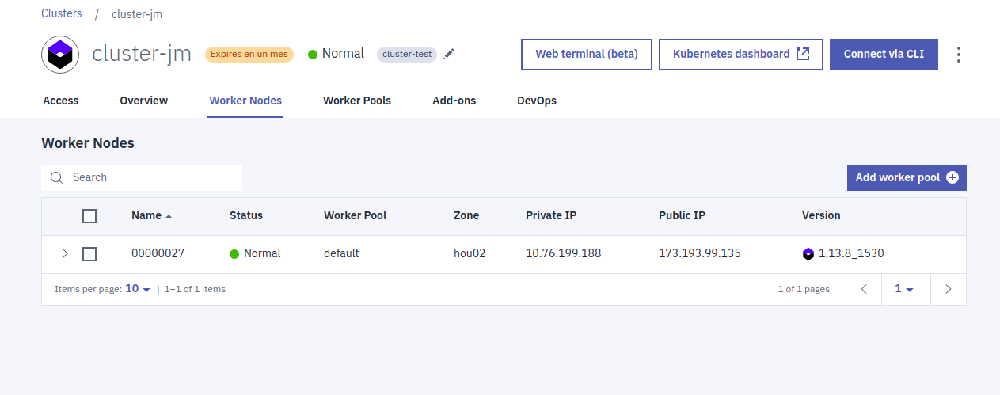

Postman - Create Customer

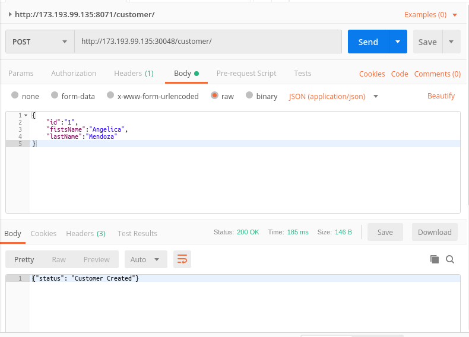

Postman - Get Customer 

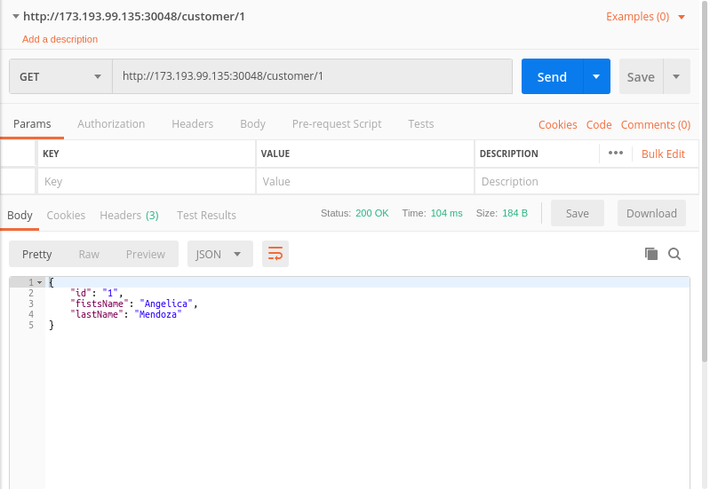

